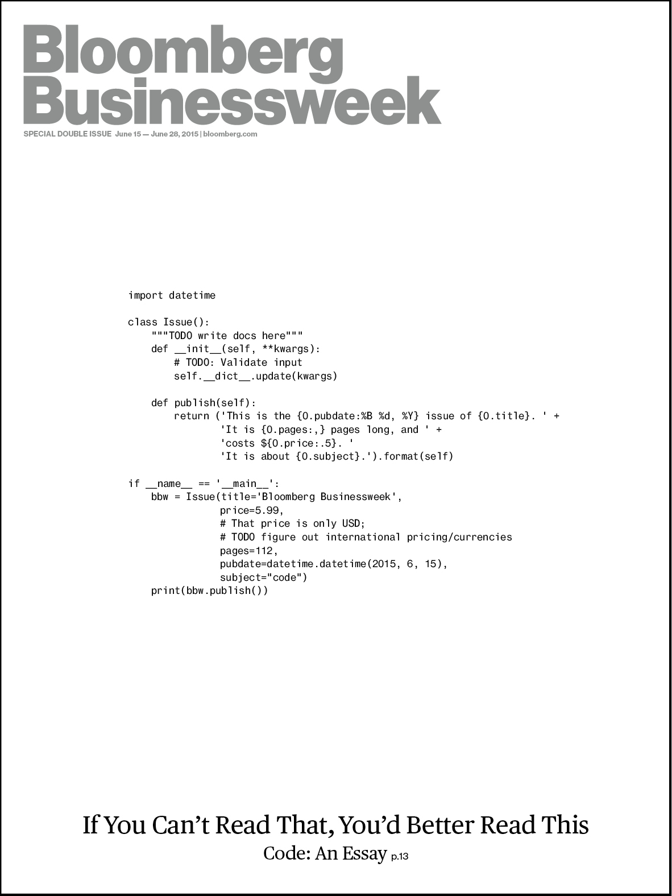

# Learning to Program, in Python

Meet Python, the best first programming language anyone should learn.
It is approachable, easy, and &mdash; most of all &mdash; real. Python is
a core language used by the worldwide scientific community &mdash; including
MIT where it is the first language taught. Python can be found everywhere
from elementary schools to Hollywood &mdash; even on the cover of the
Bloomberg Businessweek dedicated to coding:

# What We Learn

In this course students find out what coding is, why they should learn it,
and how. Students focus on programming fundamentals such as variables,
operators, blocks, logic, loops, data types, lists, dictionaries,
functions, exceptions, unit testing, and basic code organization.

Students gradually learn the same habits, tools, and workflows associated
with college computer science programs and technical careers. We code
using vim from the command-line the way most experienced professionals do.

Students learn modern Python (3.4+ not 2.7) for many obvious reasons.

# What We Don't Learn

Python-1 focuses on basic structured and procedural programming
paradigms. It does not directly cover important but more advanced concepts
such as traditional object-oriented and functional programming.  While the
games and code in Python-1 are designed to be fun, Python-1 does **not**
use Python IDLE, `turtle`, `pygame` or other made-for-education Python
technologies, which despite their prevalence are of dubious value in
the computer science and professional world. Focus is placed instead on
techniques and tools that will remain useful beyond this course. Students
are encouraged to unit test their code often by adding runnable snippets
to `if __name__ == '__main__':` but otherwise are not introduced to any
specific test frameworks.

# Planning

The pace of this course is set to what an average 8-12 year-old with
typing skills can accomplish within 70 minutes of a 90 minute class. At
this pace students this course takes about 24 hours to complete. This is
usually broken down in one of the following ways:

* 16 weeks of 90-minute classes (a semester)
* 8 weeks of 3-hour classes
* 8 days of 3-hour classes (ex: 9:30 - 12:30, M-Th) 

Bonus challenges are available for faster and older learners increasing
the age range to about 18. Above that students often become annoyed at
the younger pop culture references.

The last two weeks are a review of all the previous material. Programming
is largely like learning a foreign language and these weeks are essential
to reinforce what has been learned before moving on. This is also an
opportunity for instructors to informally assess mastery and decide
if a student is prepared to move on or needs to repeat. Unlike other
subjects and programs this course should be repeated as often as needed
until full mastery is demonstrated. Mastery is essential in programming
before progressing.

# Resources and Requirements

[![][logo]][scb] [![][cc0]][cc0link]

Students need access to a Linux command-line on a computer that has had
`python3` installed. Usually this will be through an ssh connection
(putty, etc.) to a Linux account on a school server. This could equally
be done with individual [Raspberry Pi][] computers, individual Linux
real or virtual machines, or a remote virtual host such as Digital Ocean.

GitHub accounts for each student are strongly recommended and the
[`save`](https://github.com/skilstak/python-1/blob/master/bin/save)
command can make commits easier.

[logo]: http://skilstak.com/images/skilstak-logo-bw-31.svg "SkilStak"
[scb]: README-SKB.md
[cc0]: http://mirrors.creativecommons.org/presskit/buttons/88x31/svg/cc-zero.svg "CC0 Public Domain"
[cc0link]: https://creativecommons.org/publicdomain/zero/1.0/
[Raspberry Pi]: https://www.raspberrypi.org/
